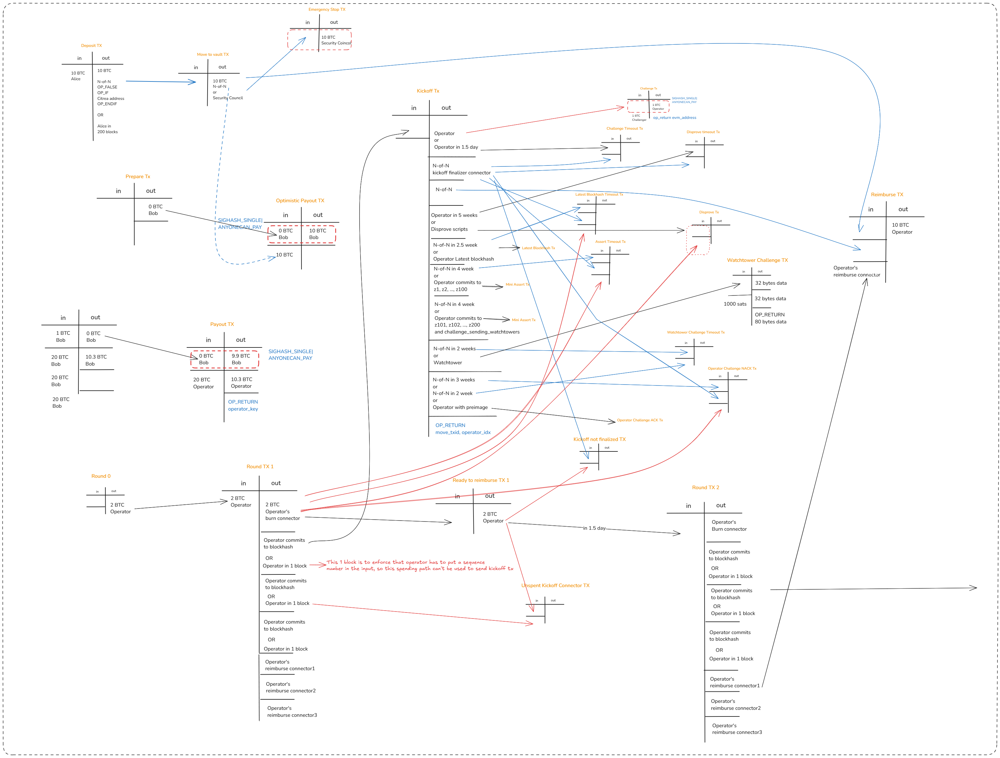
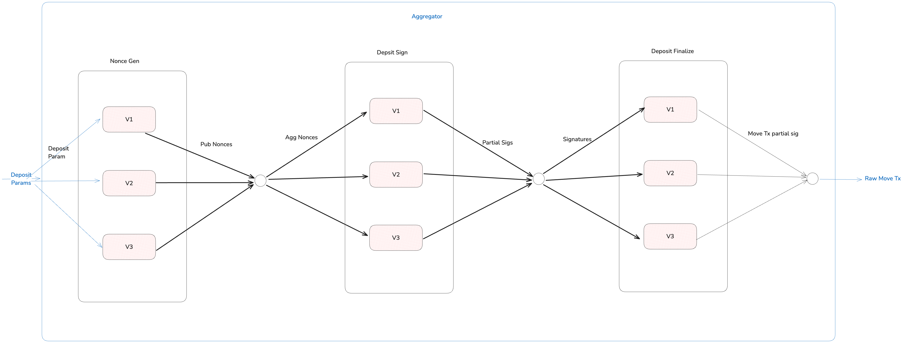

# The Design Of Clementine

Our bridge leverages BitVM for a trust minimized BTC <> Citrea bridge. The
[whitepaper](https://citrea.xyz/clementine_whitepaper.pdf) explains technicals.
Also, [https://bitvm.org/bitvm_bridge.pdf](https://bitvm.org/bitvm_bridge.pdf)
and [http://bitvm.org/bitvm2](http://bitvm.org/bitvm2) can be checked to learn
more about BitVM.

## Depositing

Aggregator is responsible for helping verifiers to finalize deposits, using
[musig2](https://github.com/bitcoin-core/secp256k1/blob/master/doc/musig.md#signing).
It has 3 steps:

1. Nonce aggregation
2. Signature aggregation
3. Move tx creation

1. In the first step, aggregator will collect nonces from all the verifiers,
   soon to be aggregated and send back to the verifiers. Aggregation is done by
   musig2.
2. At the second step, partial signatures will be requested from verifiers for
   the provided aggregated nonce. They will be aggregated using musig2, just
   like nonces. Final Schnorr signature will be sent to verifiers.
3. Aggregated signatures are used by verifiers to finalize deposit. Then,
   verifiers will return move tx partial signatures, which will later be
   aggregated. Finally, aggregator will create a move tx.

## FAQ

### Why the bridge funds stays in N-of-N not in M-of-N?

Do not think this N-of-N as a multi sig wallet, but rather as a key deletion covenant. (Covenant is a way to restrict a UTXO’s spending tx.)
The problem you would think is what if one of these signers reject to sign any message, then new deposits would not come, because N-of-N signatures would not be able to collected. But this is OK. We will have another multisig at the Bridge Contract, which is M-of-N that can update the N-of-N. This seems same as putting the bridge funds on M-of-N but IT IS NOT. Old deposits are safe if they are in N-of-N, and we can also add a time restirctions to update the N-of-N, let’s say we give 1 month to update the N. Then everyone can exit the system if they don’t trust the new N. Remember that we want our bridge to be safe as long as one of the N signers deletes their keys. We want our bridge to be live as long as one of the operators pays.

### Why bridge denominator is 10 BTC not 1 BTC?

This is still open research question. But from current observations, 1 BTC doesn’t seem feasible. The reason is, every operator puts some collateral to be used in every withdrawal. An operator can make a withdrawal once at a time to use that collateral efficiently. (If operator can make two withdrawals concurrently, we would have to send 2 disprove txs thus collateral would not be enough.) Thus our number of withdrawals are rate limited. So making it 1 BTC would make the total max TVL very low. Even 10 BTC requires a lot of operators to make this efficient. See more: https://dune.com/ekrem/bitvm-bridges-research

### Why We Use Winternitz One-Time Signatures

In Bitcoin script, with native opcodes, one can only verify Schnorr signatures that sign the transaction. In other words, one cannot verify a Schnorr signature that signs a random message. However, Winternitz and Lamport signatures can be verified just by taking hashes and checking for equality (Winternitz involves some additional mathematical operations where Bitcoin has those).
This way, we can use Winternitz to propagate state across UTXOs. For example, in BitVM, the prover signs intermediate steps; later, the same signatures can be used to disprove an incorrect proof.
In watchtower challenge transactions, watchtowers provide the longest chain proof using Winternitz signatures. This way, we get the same transaction ID, allowing us to use pre-signed transactions easily.
